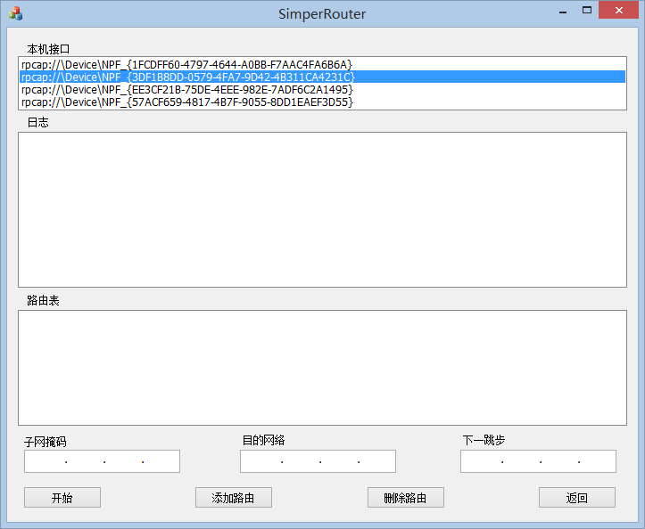
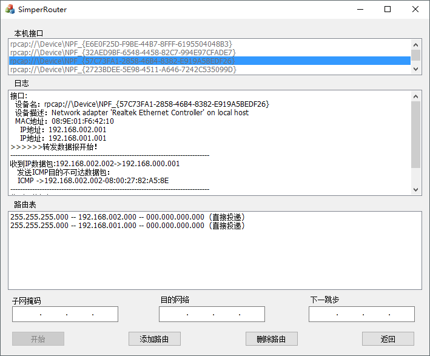

# 简单的路由程序设计

## 一、 实验要求介绍
本实验的目的是利用 visual C++编写一个简单的路由程序,实现 IP 数据报的转发。本实验可以在一个局域网中进行,采用如下图所示的实验环境:

其中路由 R1 和 R2 是连接不同子网的通用计算机,通过 R1 和 R2 上运行编制的路由程序,绑定双 IP,通过路由程序添加路由表,对接收的数据包进行分析和转发,实现处于不同网络中的主机 I 和 II 的相互通信。通信测试由ping 命令执行,可以通过 tracer +IP 地址来追踪数据包在网络中的转发路径。

## 二、 实验编译运行环境 

本程序编译环境是：Visual Studio 2012；系统环境是：Windows 8（64位）；

## 三、 编写“简单的路由器”软件运行效果
程序最终界面如下：

程序在转发数据包测试界面如下:

程序实现的功能:
	- 基本要求:
		- 静态路由表的维护:静态路由的添加、修改和删除等维护功能;自动获得与本机直接相连的路由信息
		- IP 数据报的处理:IP 数据报的接收、选路、发送(包括 ARP 解析)等工作;忽略分片处理、选项处理、动态路由等功能。
		- 日志:显示本机的网络接口、IP 数据报的接收情况、IP 数据报的选路情况、IP 数据报的发送情况。
	- 扩展实现:
		- 实现了处理 IP 数据报的 TTL 值
		- 重新计算 IP 数据报的头部校验和
		- 生成和处理 ICMP 报文

## 四、其他

实验原理和程序实现步骤及代码见代码和文档

